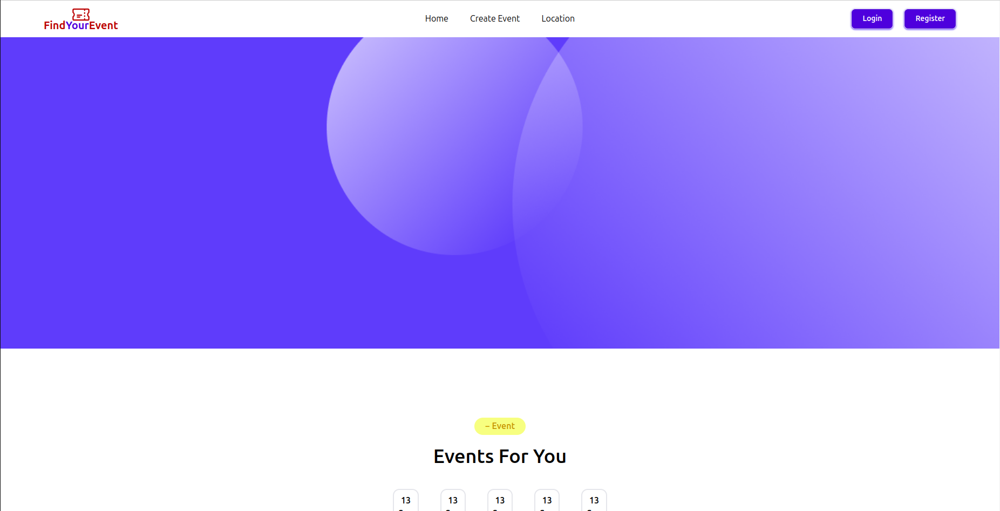
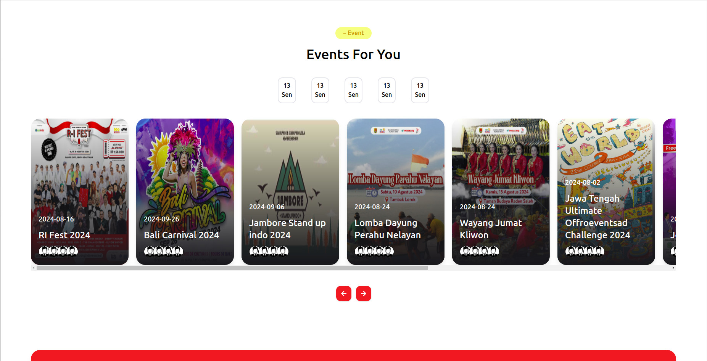
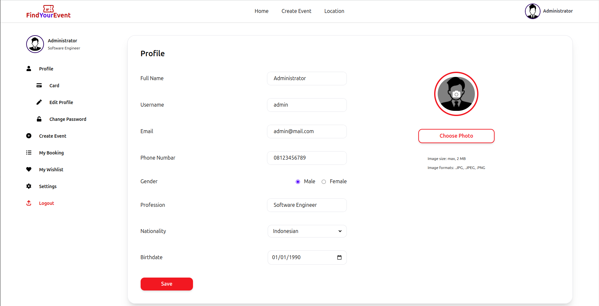

# FindYourEvent Frontend Web

Welcome to the **Find Your Event**! This project is a modern web application built using React.js, a popular JavaScript library for building user interfaces, and Tailwind CSS, a utility-first CSS framework.






## Getting Started

To run in your local, follow this simple steps:

1. **Clone this Repository**

```sh
    git clone https://github.com/ashari-dev/fgh21-react-event-organize.git
    cd fgh21-react-event-organize
```

2. **Install node_module**

```sh
    npm install
```

3. **Run program**

```sh
    npm run dev
```

and open in your browser at http://localhost:5173/

## Technologies Used

- ReactJS
- TailwindCSS

## Features

- Sleek UI Design: Tailwind CSS is employed to craft a visually appealing and user-friendly interface.
- Responsive Layout: The project ensures a seamless experience across various devices and screen sizes.

## Project Structure

The project structure is organized as follows:

- src/: Contains the source code of the project.
  - component/: Reusable components used throughout the project.
  - page/: Individual pages of the application.
  - redux/: Global state management and Sevice management

## Contributing

We welcome contributions! Please follow these guidelines:

1. Fork the repository.
2. Create a new branch for your feature or bug fix.
3. Make your changes and commit them with descriptive messages.
4. Push your branch to your forked repository.
5. Create a Pull Request to the main branch of the original repository.

Please refer to the CONTRIBUTING.md file for detailed contributing instructions.

## Contact

For any questions or feedback, please reach out to ashari.ari7@gmail.com
